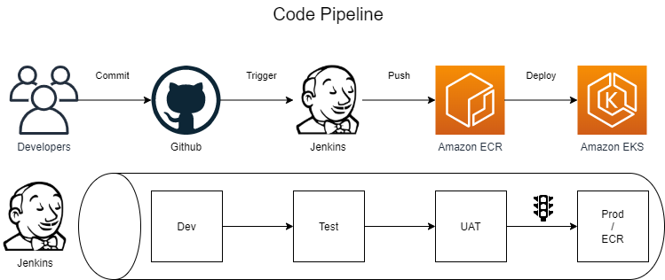
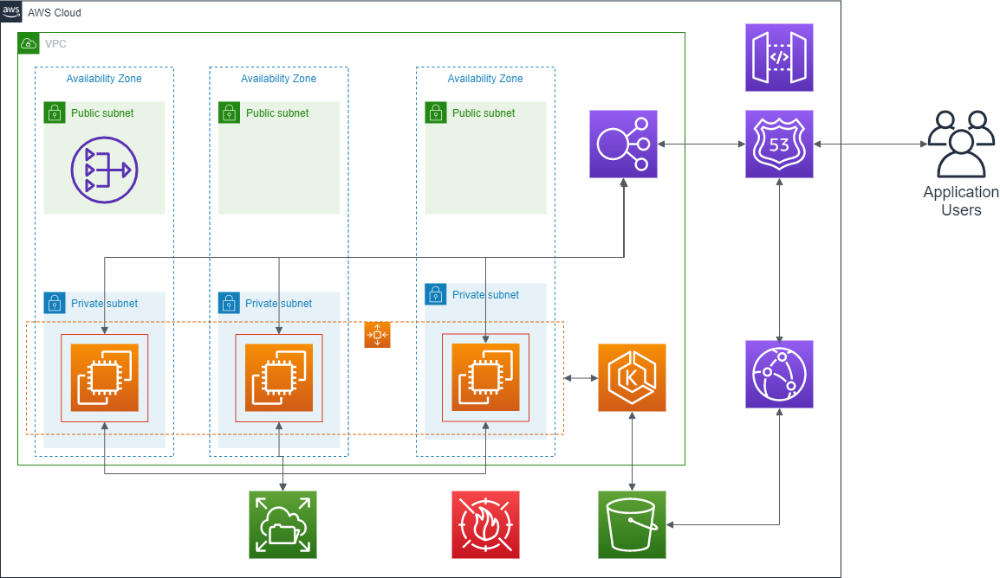

# Problem statement
A development team has created a Java web app that is ready for a limited release (with reduced availability and reliability requirements). If the limited release is successful, the app will be rolled out for worldwide use. Once fully public, the application needs to be available 24/7 and must provide sub-second response times and continuity through single-server failures - targeting 4-9’s of availability.

The application will need to have Https support through self-signed certificates. 

The development team has a continuous integration build that produce two artifacts
-	A .zip file with static parts (images, stylesheet, etc.) used for the application
-	A .war file with dynamic parts for the application

Deploy static asserts and the war file separately to any compactable server.

The app uses Prevayler for persistence. 

Design and create two environments - one for UAT/SIT and one for production. You should prepare the production environments for the limited release and plan for the scale out during fully public release.

Design and create the training and production environments, and provide a plan to scale out that deployment when the application goes public.

# Solution
For this requirement, I will go with container solution on AWS orchestrated by Kubernetes.
I assume that we would be using Jenkins for the code pipeline and the code would reside in Github.

# Alternate solutions considered
- AWS Elastic Container Service 
- AWS CodePipeline using AWS Elastic Beanstalk
- AWS Fargate

# Solution explained
## Code Pipeline
For this solution, I would be using Jenkins for the code pipeline and the code would reside in Github.



Once the developer commits and pushes the code in Github, Jenkin server will initiate a build process (Kubernetes based build that generates Docker Image) and push the Docker image into Elastic Container Registry (Amazon ECR). Then deploy the application image in Elastic Kubernetes Service (Amazon EKS) cluster.

## AWS architecture
Amazon Elastic Container Service for Kubernetes provides an orchestration platform for building and deploying cloud applications using Kubernetes. Amazon EKS is an AWS fully managed Kubernetes offering.
Since Kubernetes is cloud agnostics, deploying this solution in other cloud is also easy.



### Data Storage
As the application uses Prevalyer, which uses file system to store persistent data, I recommend the use of EFS. 
```
Amazon Elastic File System (Amazon EFS) provides a simple, scalable, fully managed elastic NFS file system. It is built to scale on demand to petabytes without disrupting applications. This eliminates the need to provision and manage capacity to accommodate growth.
Amazon EFS is designed to provide massively parallel shared access to thousands of Amazon EC2 instances, enabling the application to achieve high levels of aggregate throughput and IOPS with consistent low latencies.
Amazon EFS is a regional service storing data within and across multiple Availability Zones (AZs) for high availability and durability. Amazon EC2 instances can access the file system across AZs, regions, and VPCs.
Amazon EFS offers two storage classes: the Standard storage class and the Infrequent Access storage class (EFS IA). EFS IA provides price/performance that's cost-optimized for files not accessed every day. By simply enabling EFS Lifecycle Management on the file system, files not accessed according to the lifecycle policy will be automatically and transparently moved into EFS IA. 
```

### Static Content
Since part of the application has static content this section of the application can be stored in AWS S3. 
```
Amazon Simple Storage Service (Amazon S3) is an object storage service that offers industry-leading scalability, data availability, security, and performance. Amazon S3 provides easy-to-use management feature so the data can be organized and configure finely-tuned access controls to meet the specific business, organizational, and compliance requirements. Amazon S3 is designed for 99.999999999% (11 9's) of durability.
```

### Fast response
Since the application should provide sub second response time, recommended to use AWS CloudFront (CDN).
```
Amazon CloudFront is a fast content delivery network (CDN) service that securely delivers data, videos, applications, and APIs to customers globally with low latency, high transfer speeds, all within a developer-friendly environment. CloudFront works seamlessly with services including AWS Shield for DDoS mitigation, Amazon S3, Elastic Load Balancing or Amazon EC2 as origins for the application. Lastly, on using AWS origins such as Amazon S3, Amazon EC2 or Elastic Load Balancing, no payment require  for any data transferred between these services and CloudFront.
```

## Part Implementations
### Kubernetes
The steps for Kubernetes implementation is explained in the [Kubernetes](./Kubernetes) section

### IaaS
Cloud formation for VPC, Subnet and network associations is provided in the [CodeInfrastructure](./CodeInfrastructure) section

# Suggestions
Its recommend to move to a RDS solution instead of Prevayler because of the following benefits
- Prevayler uses filesystem. This is not a good cloud design pattern
- RDS is fully managed
- RDS can provide read replica


# Design principles considered
This solution has been designed keeping in mind the AWS Well architected Framework.

#### Operational Excellence
- Provisioned the environment as code (cloud formation scripts for Kubernetes)
- The changes to the provisioning is via code configuration. Run the plan, validate and execute
- If monitoring was in scope, then AWS Cloud Watch and Alarm would be implemented for monitoring
#### Security 
- Created IAM user, groups, roles and policies and provided permission only for the required access
- The traffic in the internet is via https.
- All the application containers are in private subnet protected by AWS security group and NACL.
- AWS WAF is also considered 
- As logging is out of scope did not implement tractability
#### Reliability
- Using AWS managed services makes sure the services runs fine
- Designed the solution for multi availability zone
- Implemented auto scaling to increased workloads
- Infrastructure as a code helps in creating a reliable environment every time
#### Performance Efficiency
- Provided a container based approach with Kubernetes orchestration managed by AWS
- Using a CDN to deliver content fast to the user
- Auto scaling enables to increase capacity only when needed and scale down happens when right
#### Cost Optimization
- Solution uses AWS managed services to reduce cost of ownership
- Provision compute capacity based on the need of the hour 
- CND would increase the cost but a conscious decision to meet the business need for speed
- EFS is considered but lifecycle policy can be implemented to reduce cost
